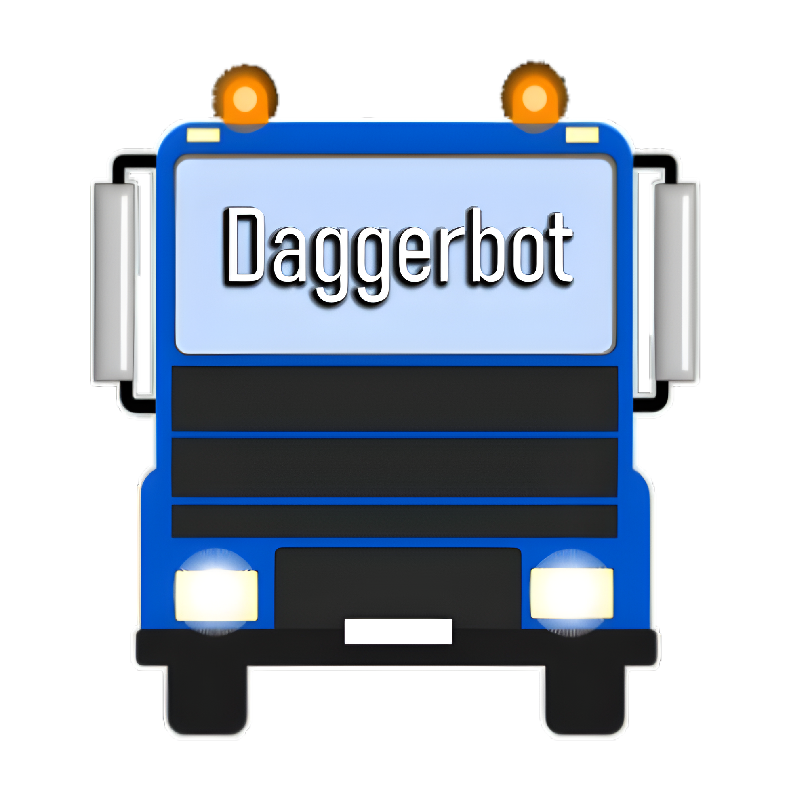

  
  <h1 align='center'>Daggerbot Rev.4 Discord bot written in Rust</h1>

Development started somewhere around **December 2023** (Rust 1.74+) and has been going pretty well to this day since then. 
This includes a language rewrite and a more reliable features than previous revision while being efficient and performant as possible!

Notable features;-
- FSMP infrastructure with the HTTP backend being hosted separately
- gRPC service support (for above)
- (Auto)moderation
- Lua 5.4 environment for small parts of the bot
- Autoresponders
- Legacy prefix commands for basic operations
